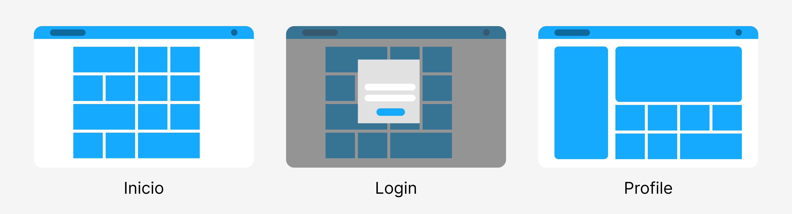

# Sites BEDU
### Proyecto Final de Módulo Programación con Python

Introducción:
Proyecto de una pastelería donde se trabajaron 3 áreas: 
* Página web con Flask
* Base de datos 
* Diseño UX/UI de la Interfaz de Usuario.

## Diseño de Wireframes para página web

Se trabajo en el el diseño de baja fidelidad para nuestra página web.

